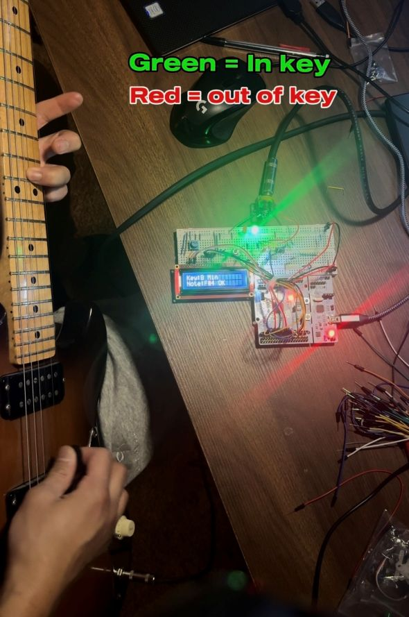
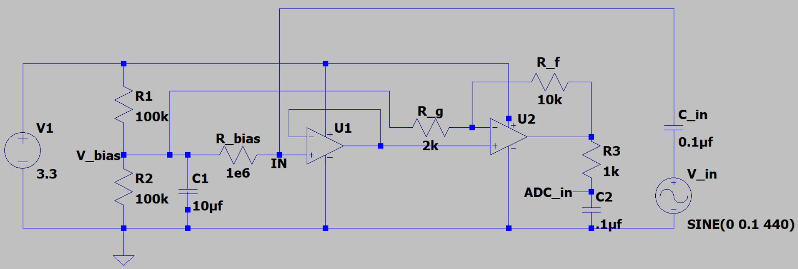
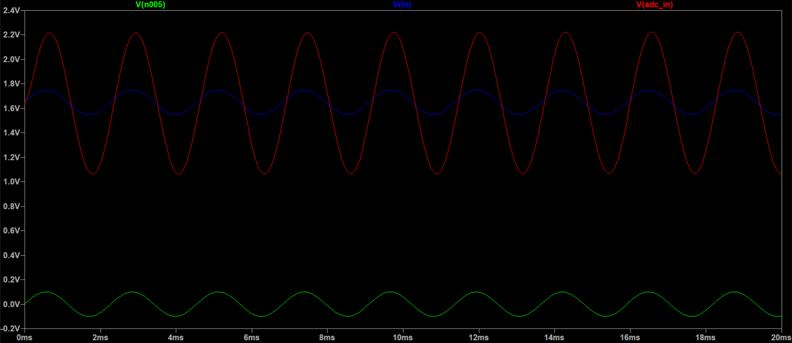
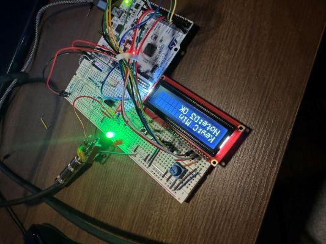
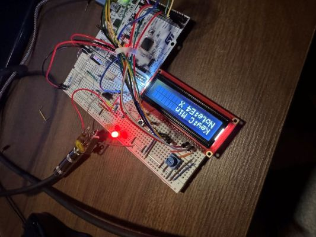

# 🎸 STM32 Guitar Pitch & Key Detection System

A real-time embedded system that detects guitar pitch, determines whether notes belong to a selected musical key, and provides immediate visual feedback using an LCD and LED indicators.

The project integrates **analog signal conditioning**, **deterministic ADC sampling**, **digital signal processing**, and a **firmware-driven embedded UI** on an STM32 microcontroller.

---

## Overview

Electric guitar pickups produce an AC signal whose frequency corresponds to the played note. This system conditions that signal for safe ADC sampling, detects pitch in real time, evaluates key membership (major/minor), and displays the result on-device.

The system is fully standalone and runs entirely on an **STM32 NUCLEO-F446RE**.

---

## Hardware Summary

- **MCU:** STM32 NUCLEO-F446RE  
- **Input:** Electric guitar (¼” TS jack)  
- **Op-Amp:** MCP6002 (rail-to-rail, single-supply)  
- **Display:** 16×2 HD44780-compatible LCD  
- **Inputs:** Pushbuttons (key select, major/minor toggle)  
- **Indicators:** Red/Green LEDs (out-of-key / in-key)  
- **Supply:** 3.3 V single-supply operation  

---

## Analog Front-End Design

The analog front-end prepares the raw guitar signal for accurate ADC sampling.

*The circuit diagram of the analog front-end.*

### Signal Conditioning Stages

1. **AC Coupling**  
   A 0.1 µF capacitor blocks DC from the guitar pickup.

2. **Mid-Supply Biasing**  
   A resistor divider (100 kΩ / 100 kΩ) biases the signal at 1.65 V, allowing single-supply operation with the STM32 ADC.

3. **Buffering & Gain (MCP6002)**  
   A non-inverting op-amp stage provides:
   - High input impedance to avoid loading the guitar pickup
   - Low output impedance to properly drive the ADC
   - Gain (~6×) to maximize ADC resolution without clipping

4. **ADC Input RC Filter**  
   A 1 kΩ series resistor and 0.1 µF capacitor to ground form a low-pass filter (~1.6 kHz cutoff) at the ADC input.  
   This:
   - Reduces high-frequency noise and EMI
   - Improves ADC sample-and-hold stability
   - Provides modest anti-aliasing without affecting pitch detection

*LTspice simulation showing the progression from raw guitar input V(n005), to mid-supply biased signal V(in), and finally the buffered, amplified, and RC-filtered waveform at the STM32 ADC input V(adc_in).*

---

## ADC Sampling

- **Sampling rate:** 8 kHz  
- **Resolution:** 12-bit  
- **Buffer size:** 1024 samples  
- **Timing:** Hardware timer (TIM2) interrupt-driven

A hardware timer triggers ADC reads at a fixed rate, ensuring deterministic sampling suitable for time-domain DSP.

---

## Pitch Detection (DSP)

Pitch detection is implemented using **autocorrelation**.

Key features:
- DC offset removal
- Peak-to-peak gating to reject silence
- Attack transient suppression
- Integer-lag autocorrelation search
- Parabolic interpolation for sub-sample accuracy

Detected frequencies are converted to **MIDI notes**, then reduced to **pitch classes** (C–B).

---

## Musical Key Logic

- Supports **Major** and **Natural Minor** scales
- 15 key signatures (including enharmonic equivalents)
- Key membership is determined by pitch-class comparison, independent of octave

---

## Embedded User Interface

- **LCD (16×2):**
  - Line 1: Selected key and mode
  - Line 2: Detected note and status (`OK` / `X`)
- **LEDs:**
  - Green = in key
  - Red = out of key
  - Both off = idle
- **Buttons:**
  - Toggle Major / Minor
  - Cycle key signatures

UI logic includes software debouncing and display update suppression to prevent flicker.

*In-key example.*

*Out-of-key example.*

---

## Firmware

- **Language:** C / C++
- **Framework:** Arduino STM32 core
- **Peripherals:** ADC, GPIO, hardware timers
- **Libraries:** LiquidCrystal (HD44780)

---

## Future Improvements

- Polyphonic key detection using FFT/chroma features
- Higher sample rates and DMA-based ADC
- Custom PCB integration
- USB/BLE interface for external visualization
